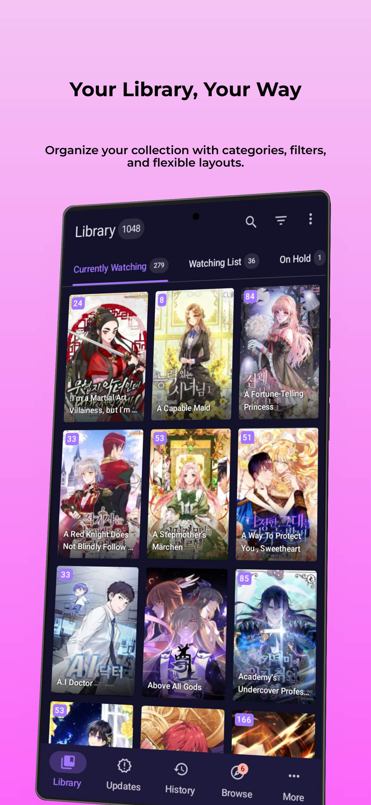
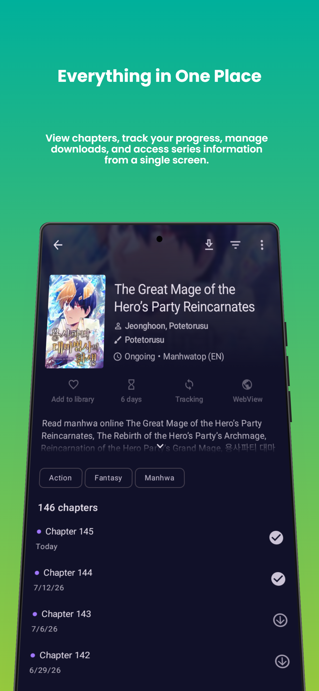
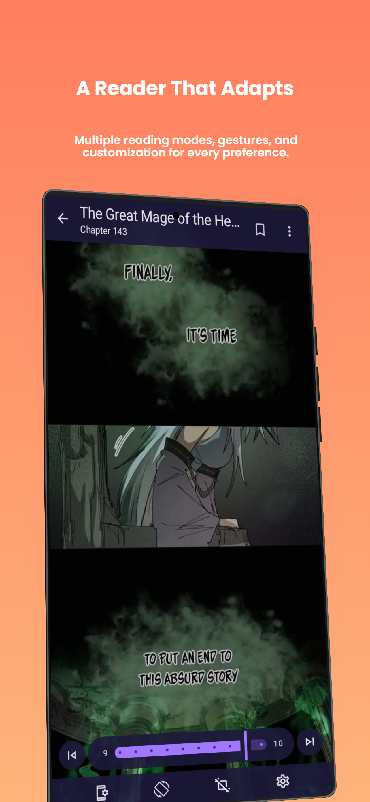

# Taihon

### Enhanced manga reader

Read manga, webtoons, comics, and more with additional features built on top of Mihon.

## Download

*Requires Android 8.0 or higher.*

⭐ If you enjoy Taihon, consider giving the project a star.

## Screenshots

  
  
  

---

# Why Taihon?

Taihon is an enhanced Mihon experience for users who want more control, better performance, and
additional quality-of-life improvements.

It stays closely aligned with upstream Mihon to maintain the stability and compatibility users
expect, while introducing carefully selected enhancements that improve everyday reading without
changing the familiar experience.

# Taihon Features

## ⚡ Performance

* Download multiple chapters simultaneously (2 by default, configurable up to 5).
* Faster library updates.
* Faster global searches.

## 📚 Library

* Filter your library by source.
* Display source icons on library items.
* Easily identify manga from unavailable or removed sources.
* Quickly search your library by tapping the toolbar.

## 🔎 Search

* Enrich search results with manga details, including:
  * Latest released chapter
  * Total available chapters
* Smart apostrophe matching to find more results for titles with different apostrophe characters (
  e.g., O'clock matches O՚clock).

## 📖 Reading

* Customize animation speed and scroll distance.
* Continue Reading button on manga details pages.
* Quick scroll buttons on chapter list.

## ⚙️ Customizations

* Badges highlight Taihon-exclusive settings.
* Increase webtoon maximum side padding to 40%.
* More shortcuts in the source menu.
* Hide or disable the Local Source.
* More automatic backup interval options.
* Keep up to 12 automatic backups by default, configurable up to 100.

# Mihon Base Features

* Read manga, manhwa, webtoons, comics, and other supported content.
* Local reading support.
* Configurable reader with multiple viewers, reading directions, and extensive customization.
* Track reading progress with:
  * MangaBaka
  * MyAnimeList
  * AniList
  * Kitsu
  * MangaUpdates
  * Shikimori
  * Bangumi
  * Hikka
* Organize your library using categories.
* Light and dark themes.
* Scheduled library updates.
* Local and cloud backup support.
* Large extension ecosystem through external repositories.
* Much more.

# Credits

Taihon is built upon Mihon.

A huge thanks to the Mihon Open Source Project and every contributor whose work makes this project
possible.

# Contributing

Contributions are welcome.

Please read the [Code of Conduct](./CODE_OF_CONDUCT.md) and
the [Contributing Guide](./CONTRIBUTING.md) before opening a pull request.

If you're planning a major change, please open an issue first so the proposal can be discussed.

Before reporting an issue, check the [FAQ](https://mihon.app/docs/faq/general), review
the [changelog](https://mihon.app/changelogs/), search
existing [issues](https://github.com/mihonapp/mihon/issues), or join
the [Discord server](https://discord.gg/mihon).

# Disclaimer

The developers of this application are not affiliated with any content providers.

Taihon does not host or distribute any content.

# License

<pre>
Copyright © 2015 Javier Tomás
Copyright © 2024 Mihon Open Source Project

Licensed under the Apache License, Version 2.0 (the "License");
you may not use this file except in compliance with the License.
You may obtain a copy of the License at

http://www.apache.org/licenses/LICENSE-2.0

Unless required by applicable law or agreed to in writing, software
distributed under the License is distributed on an "AS IS" BASIS,
WITHOUT WARRANTIES OR CONDITIONS OF ANY KIND, either express or implied.
See the License for the specific language governing permissions and
limitations under the License.
</pre>
